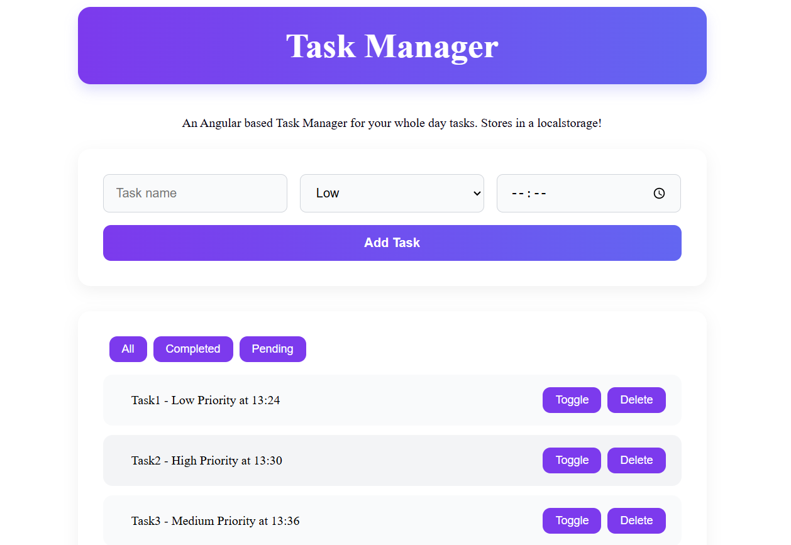

# Task Manager 

A Task Manager for your whole day built using Angular and Typescript.
- Stores tasks in local storage so that you can retrieve.
- You can add, toggle, delete, and filter tasks according to their status.

---

